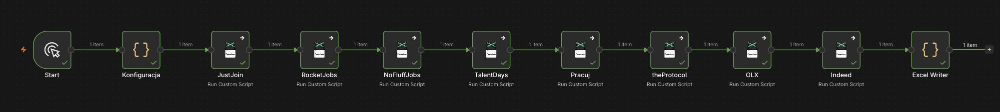
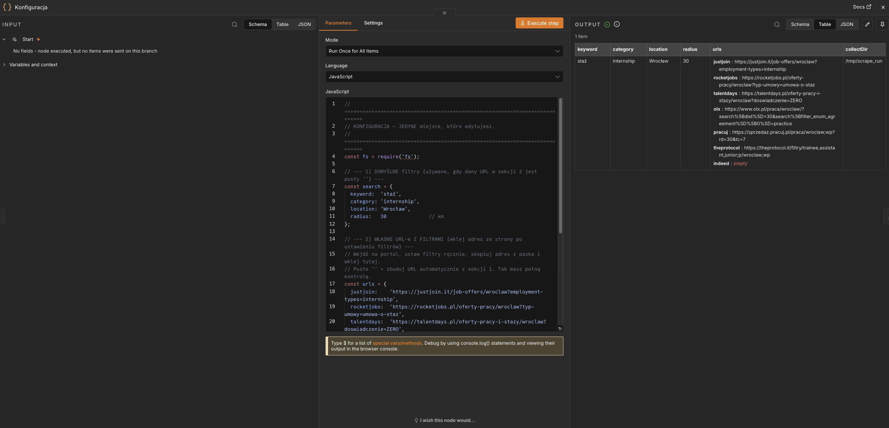
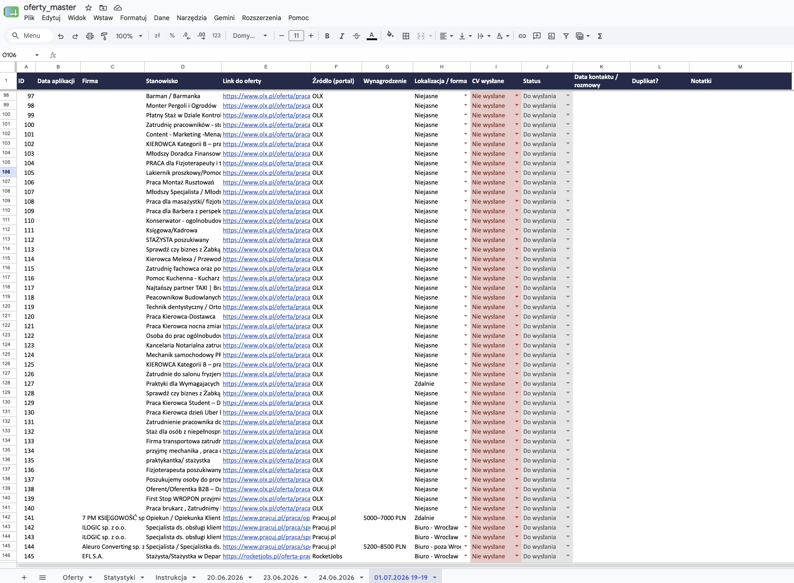

# n8n Job Board Scraper 🇵🇱

> A self-hosted, block-resistant automation that scrapes **8 Polish job boards** in one click and collects the offers into a single, beautifully-formatted Excel **application tracker** — complete with status dropdowns, colour-coding, and a new dated tab for every run.

<p>
  
  
  
  
</p>

Checking eight job sites by hand every morning is slow and demoralising. So I built a one-click pipeline that visits them all, respects each site's own filters (internships / *staż* / *praktyki*), and drops every offer into a colour-coded Excel tracker where I record where I've applied. Everything runs **locally** on my own machine — no cloud, no accounts, no data leaving my laptop.

---

## ✨ Features

- **8 portals, one run** — JustJoin.it · RocketJobs · NoFluffJobs · theProtocol · Pracuj.pl · OLX · TalentDays · Indeed.
- **Filter-based, not keyword-guessing** — uses each site's *own* internship/staż filter so nothing relevant is missed. Prefer full control? Paste your own filtered URL straight from the browser and the scraper reproduces it exactly.
- **Block-resistant by design** — sites are scraped **one at a time** with randomised, human-like delays; each uses the lightest viable strategy (hidden JSON API where one exists, a real headless browser where needed) and a **stop-on-block circuit breaker** so a soft block never escalates to a ban.
- **One master Excel, a new dated tab per run** — a 13-column tracker with a **Status dropdown** (`Do wysłania` / `Wysłane` / `Rozmowa` / `Oferta!` / `Odmowa` …), colour-coded rows, clickable offer links and a frozen header.
- **History-safe** — new tabs are *appended*; previous runs and your notes are never overwritten.
- **LLM-ready** — the master file is designed to be handed to an AI assistant (e.g. Claude Code) that builds a **profile-matched shortlist** tab: duplicates and roles you've already applied to removed automatically.

## 🖼️ Screenshots

**The workflow** — Config → 8 scrapers → Excel Writer, one browser at a time:



**One config node controls everything** — edit the filters or paste a site URL:



**The output** — a colour-coded Excel tracker with status dropdowns and clickable links:



## 🏗️ How it works

```
        Manual / scheduled trigger
                 │
          ┌──────▼───────┐   ← edit ONE node to change what you search:
          │ Konfiguracja │     keyword · category · location · radius
          └──────┬───────┘     (or paste a filtered URL per site)
                 │  writes /tmp/scrape_config.json
   ┌─────────────▼──────────────────────────────────────────┐
   │  8 scrapers, chained — one browser at a time (gentle)    │
   │  JustJoin → RocketJobs → NoFluff → TalentDays →          │
   │  Pracuj → theProtocol → OLX → Indeed                     │
   │  each: random delays · block-detection · common schema   │
   └─────────────┬───────────────────────────────────────────┘
                 │  each writes its offers to /tmp/scrape_run/*.json
          ┌──────▼───────┐
          │ Excel Writer │  → output/oferty_master.xlsx  (new dated tab)
          └──────────────┘
```

Each portal needs a different technique — this is where most of the engineering went:

| Portal | Access method | Anti-bot handling |
|---|---|---|
| **JustJoin.it / RocketJobs** | Hidden `v2/user-panel/offers` JSON API, filtered server-side by city + employment type | none needed (public API) |
| **NoFluffJobs** | JSON API called from within a real browser context | cookies via real browser |
| **TalentDays** | JSON-RPC `jobOffers/list` API with cursor pagination | — |
| **Pracuj.pl / theProtocol** | Real headless browser (Puppeteer): DOM parsing + URL pagination | Cloudflare-aware; slow, human-like pacing |
| **OLX** | Real browser: card DOM + numbered pagination | DataDome-aware: gradual scrolling, randomised waits |
| **Indeed** | Real browser (best-effort) | Cloudflare + CAPTCHA — frequently blocks; handled gracefully |

> Design note: the safest scrape is the lightest one. Three of the eight sites expose a clean JSON feed, so the tool opens only a minimal browser page (to inherit real cookies), then calls that API directly — reserving heavy DOM scraping for the sites that genuinely require it.

## 🧰 Tech stack

**n8n** (workflow orchestration) · **Puppeteer** via **Browserless** (headless Chrome) · **ExcelJS** (styled `.xlsx` with data-validation dropdowns & conditional formatting) · **Docker Compose** · **Node.js**.

## 🚀 Setup — step by step

**Prerequisite:** [Docker Desktop](https://www.docker.com/products/docker-desktop/) installed and running.

```bash
# 1. Clone
git clone https://github.com/fluxsiarski/n8n-job-scraper.git
cd n8n-job-scraper

# 2. Start the stack + install the required modules (one command)
./scripts/setup.sh
```

<details>
<summary>…or do step 2 manually</summary>

```bash
docker compose up -d
# install the Puppeteer node + ExcelJS into n8n's custom-nodes folder:
docker exec "$(docker compose ps -q n8n)" sh -c \
  'cd /home/node/.n8n/nodes && npm init -y >/dev/null 2>&1; npm install n8n-nodes-puppeteer exceljs'
docker compose restart n8n
```
</details>

3. Open **http://localhost:5678** and create your local owner account (stays on your machine).
4. **Import the workflow:** *Workflows → Import from File → `workflow/Job_Scraper_v2.json`*.
5. Open the **Konfiguracja** node → set your filters (or paste site URLs) → **Save**.
6. Click **Execute workflow**. After a few minutes you'll find your offers in **`output/oferty_master.xlsx`** (a fresh `DD.MM.YYYY HH-MM` tab).

Stop the stack any time with `docker compose down`.

## ⚙️ Configuration

Everything lives in the single **Konfiguracja** node:

```js
// 1) Defaults (used when a URL below is empty)
const search = { keyword: 'staż', category: 'internship', location: 'Wrocław', radius: 30 };

// 2) Paste a filtered URL from the browser to take full control of a site
const urls = {
  justjoin:   'https://justjoin.it/job-offers/wroclaw?employment-types=internship',
  rocketjobs: 'https://rocketjobs.pl/oferty-pracy/wroclaw?typ-umowy=umowa-o-staz',
  talentdays: 'https://talentdays.pl/oferty-pracy-i-stazy/wroclaw?doswiadczenie=ZERO',
  olx: '', pracuj: '', theprotocol: '', indeed: ''   // '' = auto-build from defaults
};
```

The `src/` folder mirrors the code of each workflow node (Config, the 8 scrapers, the Excel writer) as readable, standalone files for review.

## 📤 Output

One master workbook, one tab per run (`DD.MM.YYYY HH-MM`), 13 columns:

`ID · Data aplikacji · Firma · Stanowisko · Link · Źródło · Wynagrodzenie · Lokalizacja/forma · CV wysłane · Status · Data kontaktu · Duplikat? · Notatki`

- **Status** and **CV wysłane** are real Excel dropdowns; rows recolour automatically (green = offer, red = rejected, blue = applied, …).
- Links are clickable; the header is frozen; gridlines off for a clean look.

## ⚠️ Limitations & responsible use

- **Indeed** is behind Cloudflare + CAPTCHA and usually returns nothing from a headless browser — it's best-effort and the run simply skips it.
- **OLX** loads fine, but its programmatic filter value is broad — paste your own filtered URL for precise results.
- Run it gently, from a normal residential connection, and respect each portal's Terms of Service. This is a personal productivity tool, not a bulk-harvesting service.

## 🗺️ Roadmap

- [ ] Profile-matched **shortlist** tab generated by an LLM step (dedupe + skip already-applied).
- [ ] Optional ingestion of job-alert emails for the hardest sites.
- [ ] Scheduled runs with a daily summary notification.

## 🔗 Related

Companion **Chrome extension** (same portals, browser-side) — see my [GitHub profile](https://github.com/fluxsiarski). This n8n project automates what that extension does manually.

## 📄 License

[MIT](LICENSE) © 2026 Wiktor Zieliński · built as a personal job-hunting automation.
